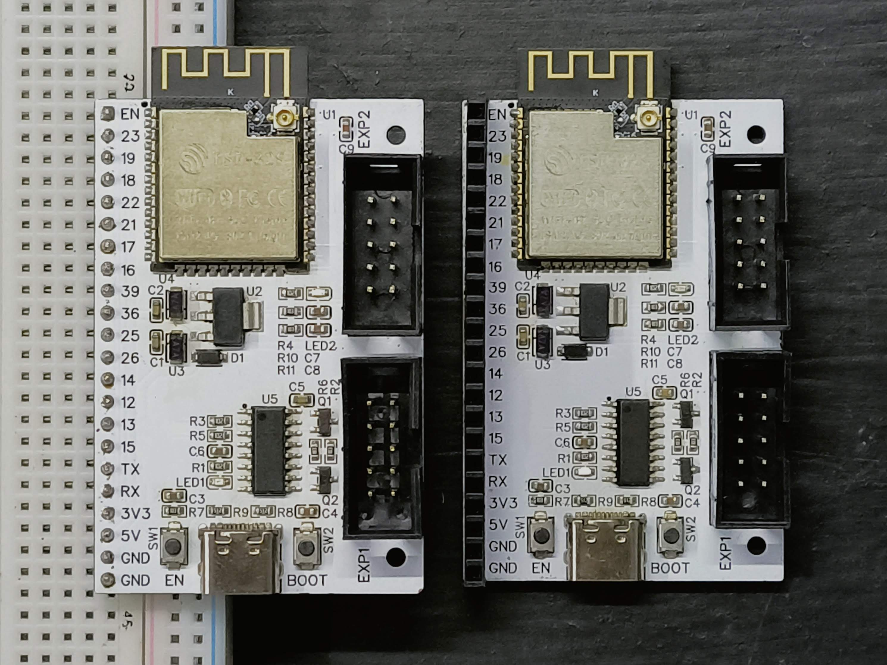

# EXP32

An ESP32 development board designed to interface with 3D printer displays.

## Key Features

* Two layer board, single sided component
* EXP1 and EXP2 ports for display connectivity
* Breadboard friendly with single row pins
* Big and visible pinout ID on both side
* Configurable setup with soldered jumper pads

## Display Compatibility

Tested and compatible with:
* BIGTREETECH MINI12864 V2.0 (set LCD_RST to EN, same with MKS)
* MKS MINI12864 V3.0
* RepRap RAMPS 12864 (set LCD_RST to 21)

Not (directly) compatible with:
* RepRap RAMPS 2004 (the board doesn't accomodate the 2 extra pins, manual connection will be required)

Other displays are yet to be tested.

## Jumper Pads Setup

RST_BTN (on-display reset button) can be configured into:
* EN: perform ESP32 reset
* 22: connected to GPIO 22 for an additional input

LCD_RST (LCD RESET on some displays) can be configured into:
* EN: permanently pulled high to prevent display reset (works on most displays)
* 21: connects LCD_RST pin to GPIO 21 if the display needs it
